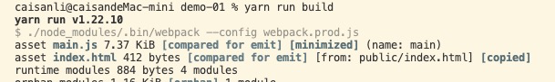

#### webpack入门，就只能入门

> 当前文档基于webpack（v5.69.1）webpack-cli（v4.9.2）Nodejs（v10.13.0+）
>
> 希望学完后，想想你能用webpack做点不一样的，而不是仅文档中的内容

**目录介绍**

* demo-01：简单的demo，主要使用一些核心配置
* demo-vue：搭建一个vue项目
* node-server：一个静态服务，用于部署打包后的文件
* images：文档需要的图片

##### 运行逻辑

> 待完善

webpack启动后会在entry里配置的module开始递归解析entry所依赖的所有module，每找到一个module, 就会根据配置的loader去找相应的转换规则，对module进行转换后在解析当前module所依赖的module，这些模块会以entry为分组，一个entry和所有相依赖的module也就是一个chunk，最后webpack会把所有chunk转换成文件输出，在整个流程中webpack会在恰当的时机执行plugin的逻辑。


##### 概念

----

**entry（入口文件）**

`entry`既执行指示`webpack`应该使用哪个模块，来作为构建其内部的`依赖图`的开始。进入`entry`后，`webpack`会找出有哪些模块和库是`entry`（直接和间接）依赖的。默认值是`./src/index.js`。

```js
module.exports = {
  entry: './index.js'
}
```

**output（输出）**

`output`告诉`webpack`在哪里输出它所创建的`bundle(包)`，已经如何命名这些文件。主要输出文件的默认值是`./dist/main.js`

```js
module.exports = {
  entry: './index.js',
  output: {
    path: path.resolve(__dirname, 'dist'), // 指定输出目录
    filename: 'main.bundle.js' // 指定输出的文件名
  }
}
```

**loader**

`webpack`只能处理`javascript`和`json`文件。而`loader`可以让`webpack`去处理其它类型的文件。

```js
module.exports = {
  module: {
    rules: [{
      test: /\.txt$/, // 识别哪些文件会被转换
      use: 'raw-loader' // 在转换时，应该使用哪个loader
    }]
  }
}
```

**plugin（插件）**

`loader` 用于转换某些类型的模块，而`plugin`则可以用于执行范围更广的任务。包括：打包优化，资源管理，注入环境变量。

```js
const HtmlWebpackPlugin = require('html-webpack-plugin');
const webpack = require('webpack'); // 用于访问内置插件

module.exports = {
	// ...
  plugins: [new HtmlWebpackPlugin({ template: './src/index.html' })],
};
```

**mode（模式）**

通过选择`development`、`production`或`none`之中的一个，来设置`mode`参数，以启用`webpack`内置在相应环境下的优化。其默认值为`production`。

```js
module.exports = {
  mode: 'production'
}
```

##### 牛刀小试

---

> 下面步骤基本上是配置`webpack`环境的基础步骤，后续不会重复讲

1. 创建一个名为demo-01的文件夹，并初始化项目

```shell
yarn init
```

2. 安装webpack依赖

```shell
yarn add webpack webpack-cli -D
```

3. 安装`copy-webpack-plugin`插件，用于将指定目录或文件拷贝到输出文件中

```shell
yarn add copy-webpack-plugin -D
```

4. 安装`style-loader`、`css-loader`lodaer，用于转换`css`文件

```shell
yarn add style-loader css-loader -D
```

5. 安装`lodash`

```shell
yarn add lodash
```

6. 在项目根目录下创建一个`webpack`配置文件：`webpack.config.js`，并设置内容：

```js
const path = require('path')
// 将已存在的单个文件或整个目录复制到构建目录中
const CopyWebpackPlugin = require('copy-webpack-plugin')
module.exports = {
  entry: './src/index.js', // 入口文件配置
  output: { // 输出文件配置
    filename: 'main.js',
    path: path.resolve(__dirname, 'dist'),
  },
  mode: 'production', // 设置模式
  module: {
    rules: [{ // 对 css 文件进行转换
      test: /\.css$/,
      use: ['style-loader', 'css-loader']
    }]
  },
  plugins: [
    new CopyWebpackPlugin({
      // 这里将 public 目录复制到输出目录
      patterns: ['public']
    })
  ]
}
```

7. 在项目根目录下创建`src/index.js`、`src/assets/css/index.css`、`public/index.html`

设置`src/index.js`：

```js
import throttle from 'lodash/throttle';
// 使用 css-loader 将css文件转换成模块
import './assets/css/index.css';

let count = 0;
const $box = document.querySelector('.box');
const $count = document.querySelector('#count');

const scrollFn = throttle(() => {
  $count.innerHTML = (++count);
}, 1000)

$box.addEventListener('scroll', scrollFn);
```


设置`src/assets/css/index.css`：

```css
.box {
  height: 249px;
  overflow: auto;
  background-color: #e6e6e6;
  border: 1px solid #eee;
}

.child {
  height: 19999px;
}
```


设置`dist/index.html`

```html
<!DOCTYPE html>
<html lang="en">
<head>
  <meta charset="UTF-8">
  <meta http-equiv="X-UA-Compatible" content="IE=edge">
  <meta name="viewport" content="width=device-width, initial-scale=1.0">
  <title>demo-01</title>
</head>
<body>
  <p>使用节流，执行了<span id="count">0</span>次方法</p>
  <div class="box">
    <div class="child"></div>
  </div>
  <script src="./main.js"></script>
</body>
</html>
```

8. 配置`package.json`的`scripts`，`webpack`命令会默认去找根目录下的`webpack.config.js`文件，也可以手动配置：

```json
{
  //...
  "scripts": {
    "build": "webpack --config webpack.config.js", // 手动配置
  }
}
```

9. 开始打包，运行：

```shell
yarn run build
```

输出：




##### 搭建一个Vue项目

----

> 搭建过程中，会进一步了解webpack用法，包括`配置`及`loader`、`plugin`

**1. 初始化项目**

初始化一个名为`vue-demo`的项目，步骤见上面的案例。

生成如下目录：

```tsx
|-- build
		|-- webpack.prod.js
|-- public
		|-- index.html
|-- src
		|-- main.js
|-- package.json
```

**2. 基础配置**

设置`entry`、`output`、`mode`：

```js
module.exports = {
  mode: 'production', // 设置为生产环境
  entry: './src/main.js', // 设置入口文件
  output: {
    publicPath: '/', // 静态资源前缀地址
    filename: '[name].[contenthash].bundle.js',
    clean: true // 清空打包目录，这里默认是dist目录
  },
}
```

`filename`里面的的`[name]、[contenthash]`是`webpack`内部的[替换模板字符串](https://webpack.docschina.org/configuration/output/#template-strings)。

* `[name]`：文件名
* `[contenthash]`：此 chunk 的 hash 值，只包括该内容类型的元素

编辑`public/index.html`

```html
<!DOCTYPE html>
<html lang="en">
<head>
  <meta charset="UTF-8">
  <meta http-equiv="X-UA-Compatible" content="IE=edge">
  <meta name="viewport" content="width=device-width, initial-scale=1.0">
  <title>vue</title>
</head>
<body>
   <!- 设置vue节点 ->
  <div id="app"></div>
</body>
</html>
```

将`public/index.html`打包到打包目录，安装`html-webpack-plugin`，[相关配置文档](https://github.com/jantimon/html-webpack-plugin#options)，该插件可以简化HTML文件的创建，以及将打包后的`css`、`javascript`自动引入到`index.html`文件中。

```shell
yarn add html-webpack-plugin -D
```

配置`webpack.prod.js`:

```js
const HtmlWebpackPlugin = require('html-webpack-plugin')
module.exports = {
  plugins: [
    new HtmlWebpackPlugin({
      inject: 'body', // 将打包的js文件放入body最后，默认是放在head
      template: './public/index.html' // 配置index.html的模板
    })
  ]
}
```

将`public`目录下的所有文件拷贝到打包目录，作为静态文件使用，安装`copy-webpack-plugin`，[相关配置文档](https://github.com/webpack-contrib/copy-webpack-plugin#options)。

```shell
yarn add copy-webpack-plugin -D
```

配置`webpack.prod.js`，注意这里拷贝文件和上面的`html-webpack-plugin`冲突，它们都会同时操作`index.html`，所以拷贝的时候排除了`index.html`。

```js
const CopyPlugin = require('copy-webpack-plugin')
module.exports = {
  plugins: [
    new CopyPlugin({
      patterns: [{
        from: './public',
        to: './',
        filter: async (resourcePath) => { // 这里排除index.html 不然会和HtmlWebpackPlugin插件冲突
          if (resourcePath.endsWith('index.html')) {
            return false;
          }
          return true;
        },
      }]
    })
  ]
}
```

**3. 支持vue**

安装以下依赖

* `vue-loader`：用于编译`.vue`文件
* `vue-template-compiler`：编译对应的`vue`版本
* `vue-style-loader`：将`css`动态加入到`head`标签中，`development`环境使用
* `mini-css-extract-plugin`：将`css`提取到单独的文件，`production`环境使用

```shell
yarn add vue-loader vue-template-compiler vue-style-loader mini-css-extract-plugin -D
```

配置`webpack.prod.js`

```js
const { VueLoaderPlugin } = require('vue-loader')
const MiniCssExtractPlugin = require('mini-css-extract-plugin')
module.exports = {
  module: {
    rules: [{
      test: /.vue$/,
      use: ['vue-loader']
    }, {
      test: /\.css$/,
      use: [MiniCssExtractPlugin.loader, 'css-loader']
    }]
  },
  plugins: [
    new MiniCssExtractPlugin({
      filename: '[name].css'
    }),
    new VueLoaderPlugin()
  ]
}
```

**3. 初始化vue项目**

添加`/src/views/index.vue`:

```html
<template>
  <div class="app">
    APP
  </div>
</template>

<script>
  export default {
		
  }
</script>

<style></style>
```

编辑`/src/main.js`：

```js
import { createApp } from 'vue';
import App from './views/index.vue';

createApp(App).mount('#app')
```

这样一个简单的`vue`项目就搭建起来了


**3. CSS预处理器**

这里仅添加对`less`的支持，安装`less`、`less-loader`

```shell
yarn add less less-loader -D
```

配置`wepback.prod.js`

```js
module.exports = {
  module: {
    rules: [{
      test: /\.(le|c)ss$/,
      use: [MiniCssExtractPlugin.loader, 'css-loader', 'less-loader']
    }]
  }
}
```

添加`/src/assets/css/global.less`，并设置：

```less
body, html {
  height: 100%;
  background-color: #e6e6e6;
}
```

修改`/src/main.js`，增加对`global.less`的引入：

```js
import './assets/css/global.less'
```

修改`/src/views/index.vue`里的`style`标签：

```html
<style scoped lang="less">
  .app {
    color: red;
  }
</style>
```


**4. 图像、字体文件**

在`webpack5`之前处理资源（字体、图片、图标等）文件，通常使用：

* `raw-loader`：将文件导入为字符串
* `url-loader`：将文件作为data URL（默认为base64，也可以自定义）内联导bundle中
* `file-loader`：将文件发送到输出目录，并返回`文件地址`

而现在`webpack`已内置处理[资源模块类型](https://webpack.docschina.org/guides/asset-modules/)，来替换上面的loader：

* `asset/resource`：和`file-loader`相似
* `asset/inline`：和`url-loader`相似
* `asset/source`：和`raw-loader`相似
* `asset`：在导出一个 data URI 和发送一个单独的文件之间自动选择。之前通过使用 `url-loader`，并且配置资源体积限制实现。

配置`webpack.prod.js`：

```js
module.exports = {
  module: {
    rules: [{ // 处理图片
      test: /\.(png|jpg|jpeg|svg|gif)$/i,
      type: 'asset', 
      generator: {
        filename: 'images/[name][ext][query]'
      },
      parser: {
      	dataUrlCondition: {
          maxSize: 1024 // 1kb 小于1kb的文件用`inline`模式，反之用`resource`模式
        }
    	}
    }, { // 处理字体
      test: /\.(ttf|otf|woff|eot|woff2)$/i,
      type: 'asset/resource',
      generator: {
        filename: 'fonts/[name][ext][query]'
      },
    }]
  }
}
```

添加`/src/assets/fonts`，并添加`iconfont`相关文件

修改`/src/assets/css/global.less`，增加对`iconfont.css`引用：

```less
@import url('../fonts/iconfont.css');
```

添加`/src/assets/images`，并添加一些图片

修改`/src/views/index.vue`，增加对图片的引用

```html
<template>
  <div class="app">
    APP
    
  </div>
</template>
```


**5. Babel**

>  [如何兼容IE](https://www.yuque.com/kuitos/gky7yw/qskte2)，当前未做IE兼容

安装`@babel/core`、`@babel/preset-env`、`babel-loader`

```js
yarn add babel-loader @babel/core @babel/preset-env
```

安装`core-js`，截止当前写文档时的版本为`3.21.1`

```js
yarn add core-js
```

配置`webpack.prod.js`

```js
module.exports = {
  module: {
    rules: [{
      test: /\.js$/,
      include: /\/src/, // 只编译符合规则的模块
      use: ['babel-loader']
    }]
  }
}
```

在根目录添加`.babelrc.js`文件，设置`babel`配置，并配置：

```js
module.exports = {
	presets: [
		[
			'@babel/preset-env',
			{
				useBuiltIns: 'entry',
				corejs: '3.21.1', // 截止当前写文档时的版本
			},
		],
	],
	plugins: [],
};
```

在根目录添加`.browserslistrc`文件，设置打包工具的目标浏览器，[相关配置文档](https://github.com/browserslist/browserslist#full-list)，并配置：

```js
defaults
```

**6. resolve - alias（解析 - 别名）**

设置`路径`别名（`alias`），简化引入路径写法

配置`webpack.prod.js`：

```js
const path = require('path')
const resolve = (_path) => {
  return path.resolve(__dirname, _path);
}

module.exports = {
  resolve: {
    alias: {
      '@': resolve('../src'),
      '@views': resolve('../src/views'),
      '@assets': resolve('../src/assets')
    }
  }
}
```

更改`/src/main.js`：

```js
- import App from './views/index.vue';
- import './assets/css/global.less';
+ import App from '@views/index.vue';
+ import '@assets/css/global.less';
```

更改`/src/views/index.vue`:

```html
- 
+ 
```


**7. resolve - extensions**

设置`extensions`，简化引用文件扩展名

配置`webpack.prod.js`:

```js
module.exports = {
  resolve: {
    extensions: ['.vue', '...'], // '...'表示默认扩展 ['.js', '.json', '.wasm']
  }
}
```

更改`/src/main.js`:

```js
- import App from '@views/index.vue';
+ import App from '@views/index';
```


**8. 配置环境变量**

使用`webpack`内置模块`DefinePlugin`来定义不同环境的`环境变量`

配置`webpack.prod.js`:

```js
module.exports = {
  plugins: [
    new webpack.DefinePlugin({
      'PRODUCTION': JSON.stringify(true)
    })
  ]
}
```

更改`/src/main.js`:

```js
if (PRODUCTION) {
  console.log('当前是生产环境')
} else {
  console.log('当前不是生产环境')
}
```

**9. devtool**

[配置说明](https://webpack.docschina.org/configuration/devtool/)

